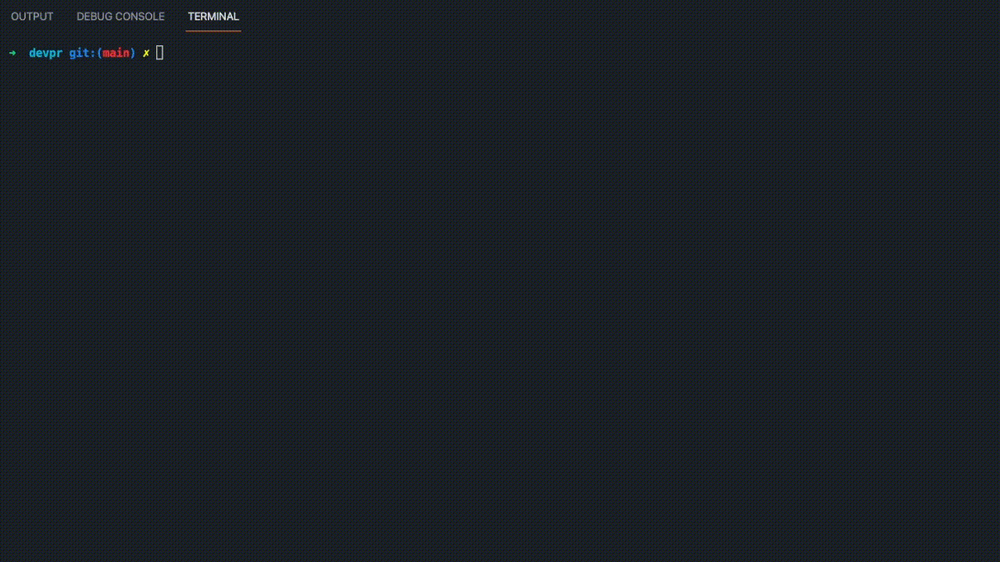
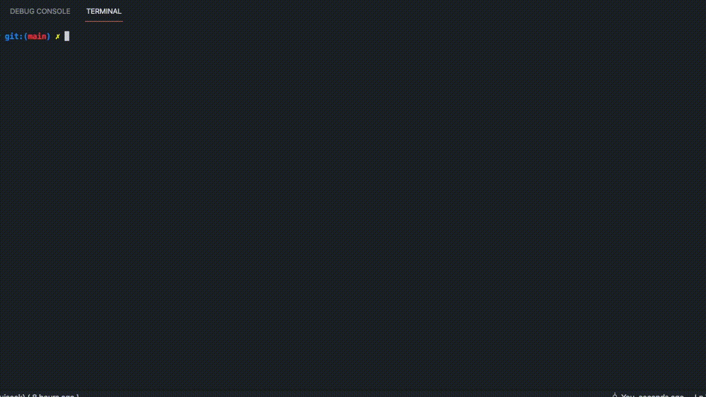
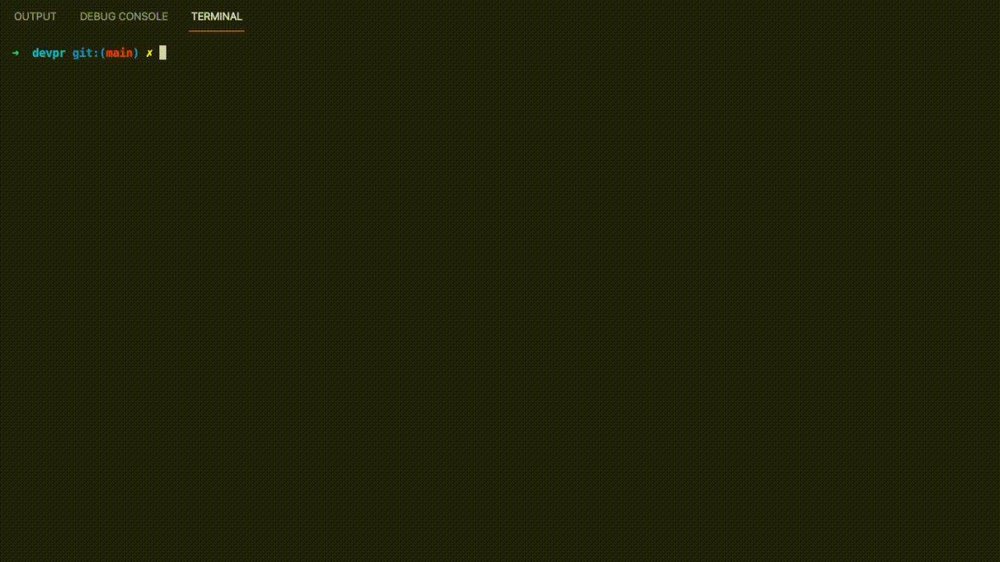
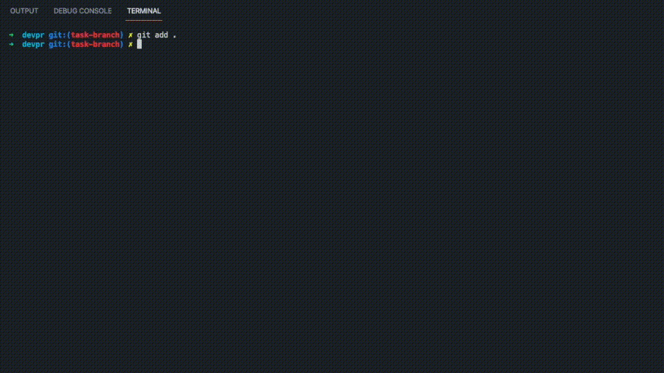

# Comunidade DevParaná

- [Aplicativos](#aplicativos)

  - [Gravação da tela](#aplicativos-gravacao-da-tela)
  - [Banco de imagens (SVG)](#aplicativos-banco-de-imagens)
  - [Apresentações com Markdown](#aplicativos-para-apresentacoes)

- [Repositório](#repositorio)

  - [Objetivo](#repositorio-objetivo)
  - [Estrutura](#repositorio-estrutura)
    - [Projetos](#repositorio-projetos)
    - [Design](#repositorio-design)
    - [Tools](#repositorio-tools)
  - [Comandos](#repositorio-mantendo)
    - [Serve](#repositorio-serve)
    - [Build](#repositorio-build)
    - [Simule](#repositorio-simulate)
    - [Commit](#repositorio-commit)
  - [Como contribuir](./CONTRIBUTING.md)

- [DevParaná](#devparana)

  - [Ideia](#devparana-ideia)
  - [Iniciativa](#devparana-iniciativa)
  - [Onde nos encontrar](#devparana-onde-nos-encontrar)

<a id="devparana"></a>

## Bem vindo ao `DevPR MX`, esperamos que você tenha a melhor experiência como membro da nossa comunidade

<a id="devparana-ideia"></a>

### A ideia deste movimento

Dar o empurrão que faltava para muito dos desenvolvedores paranaenses começar a compartilhar conhecimentos, através de MeetUps, Coding Dojo, Conferências e tudo mais que pudermos fazer.

<a id="devparana-iniciativa"></a>

### Nossa iniciativa

Auxiliar nas comunidades e movimentos nas suas ações, não competindo com os mesmos.

---

<a id="aplicativos"></a>

## Aplicativos

<a id="aplicativos-gravacao-da-tela"></a>

### Gravação da tela

Temos uma aplicação para gravação da tela, caso precise mostrar algo durante sua apresentação, você pode clonar o repositório e executar localmente ou acessar a versão web.

<!-- Alterar sub-domínio rec.devparana.org -->

[Link Web](https://devpr-recorder.surge.sh/)

[Link do Código](./apps/recorder/src/app/app.element.ts)

#### Para executar localmente

```bash
npm run recorder
```

<br>
<a id="aplicativos-banco-de-imagens"></a>

### Banco de imagens

Temos uma aplicação com milhares de imagens no formato SVG, pra que você possa usa-las em apresentações ou onde achar que faça sentido. O formato SVG é mais adequado, pois permite efetuar alterações não só via apps como Figma ou Adobe XD, mas também via código, com JavaScript. Você pode clonar o repositório e executar localmente ou acessar a versão web.

<!-- Alterar sub-domínio rec.devparana.org -->

[Link Web](https://devpr-devector.surge.sh/)

[Link do Código](./apps/devector/src/app/app.element.ts)

#### Para executar localmente

```bash
npm run devector
```

<br>
<a id="aplicativos-para-apresentacoes"></a>

### Slides com markdown

Você também pode contar com um app onde você pode preparar seus slides usando markdown, sinta-se em casa pra fazer a alteração que entender necessária para sua apresentação, quando concluída, faça o build e leve com você apenas o diretório gerado dentro de `dist`. Fácil e prático.

[Link do Código](./apps/presenter/src/main.ts)

#### Para executar

```bash
npm run presenter
```

---

<a id="repositorio"></a>

## Repositório

<a id="repositorio-objetivo"></a>

### Objetivo do repositório

Este repositório contém alguns facilitadores para organização de eventos e preparações de talks, caso tenha algo a colaborar, sinta-se a vontade para enviar um pull request contribuindo.

<a id="repositorio-estrutura"></a>

### Estrutura do repositório

<a id="repositorio-projetos"></a>

#### Projetos

O diretório [`apps`](./apps) contém apenas aplicativos

```bash
apps
├── devector      # <- banco de imagens
├── example       # <- app com exemplos
├── presenter     # <- p/ apresentações
├── recorder      # <- gravação da tela
├── recorder-e2e  # <- testes end 2 end
└── website       # <- website recursos
```

O diretório [`packages`](./packages) contém apenas bibliotecas compartilhadas entre aplicativos ou ainda, outras bibliotecas

```bash
packages
├── common
│   ├── elements  # <- webcomponents
│   └── web       # <- core elements
```

<a id="repositorio-design"></a>

#### Design

O diretório [`design`](./design) contém imagens referentes a linguagem visual do DevParaná e arquivos gerais de estilização, como paletas de cores e algumas variáveis globais.

```bash
design
├── assets
│   ├── images
│   └── logo.svg
└── styles
    └── core
        └── theming
```

<a id="repositorio-tools"></a>

#### Tools

O diretório [`tools`](./tools) contém ferramentas de gerenciamento do repositório

```bash
tools
├── generators
```

<a id="repositorio-mantendo"></a>

### Comandos

Aqui estão alguns exemplos de como podemos usar, alterar e submeter alterações para o repositório.

> **Importante!**
>
> Abaixo estão alguns exemplos, mas antes de submeter uma grande mudança, por favor, leia atentamente nosso [guia de contribuição](./CONTRIBUTING.md).

<a id="repositorio-serve"></a>

#### Para desenvolvimento

```bash
npm run recorder
```



### Para servidor web

<a id="repositorio-build"></a>

Faça o build

```bash
npm run recorder:build
```



Execute com algum servidor web de preferência, neste exemplo usarei http-server

```bash
http-server dist/apps/recorder -o
```

<a id="repositorio-simulate"></a>

### Para simular um deploy execute

```bash
npm run simulate:deploy
```



---

<a id="repositorio-commit"></a>

### Escrevendo mensagem de commit

```bash
npm run commit
```

## 

[Saiba mais sobre como contribuir](./CONTRIBUTING.md)

---

<a id="devparana-onde-nos-encontrar"></a>

<div>

<span style="float:left">

### Onde nos encontrar

## - [Github](https://github.com/DeveloperParana/)

## - [Facebook](https://facebook.com/DeveloperParana/)

## - [Instagram](https://www.instagram.com/devparana/)

## - [Twitter](https://www.instagram.com/devparana/)

## - [Meetups](https://www.meetup.com/pt-BR/developerparana/)

</span>

<span style="float:right">


</span>

</div>

<hr style="clear:both" />

Este projeto usa [Nx](https://nx.dev) workspaces.
